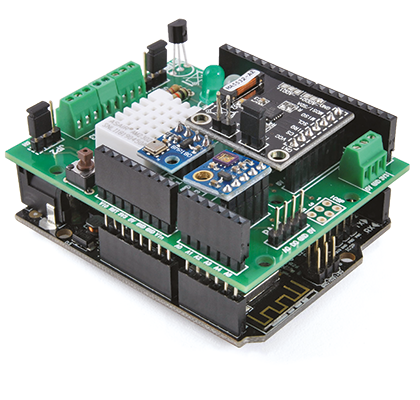
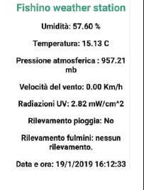

# FishinoWeatherStation

# Status: Archived

This repository has been archived and is no longer maintained because the Pushetta service does not exist anymore.

---

This project was published on ElettronicaIN [#235](https://futuranet.it/prodotto/n-235-maggio-2019/) and on [Open-Electronics](https://www.open-electronics.org/weather-station-with-a-lightning-detector-uv-sensor-temperature-humidity-pressure-and-more/).

This project is an open-source and open-hardware weather station based on a [Fishino 32](https://store.open-electronics.org/Board-Fishino-32bit) board.

It is capable of measuring:

- Temperature, through a DS18B20 sensor

- UV rays intensity, through a ML8511 sensor

- Humidity, through a DHT22 sensor

- Air Pressure, through a BMP180 sensor

- Rain detection

- Stroke detection through an AS3935 sensor

- Wind speed through an anemometer

- CO concentration through a MQ7 sensor

Once the board is connected to a WiFi network, it fetches date and time from an NTP server and sets them on its internal RTC.

Data is displayed in a web server in both Italian, English and German languages. 

Periodically data is saved in a file on an SD card (with both date and time).

When a stroke is detected the board saves data on the SD and sends a push notification through the Pushetta service.

### Hardware

The sensors are connected to the Fishino32 through an apposite shield whose schematic is reported below:

The final result is a shield as in the following picture:

### Software

The sketch is fully commented on the Open-Electronics website.

In order to make the code simpler to be understood I wrote different libraries:

- [ML8511 Sensor Library](https://github.com/signorettae/ML8511_uv_sensor_arduino_library)

- [Wind Sensor Library](https://github.com/signorettae/Wind_sensor_arduino_library)

The final result of the web page is reported below:

Readme template taken from [here](https://github.com/bremme/arduino-project/blob/master/README.md)
